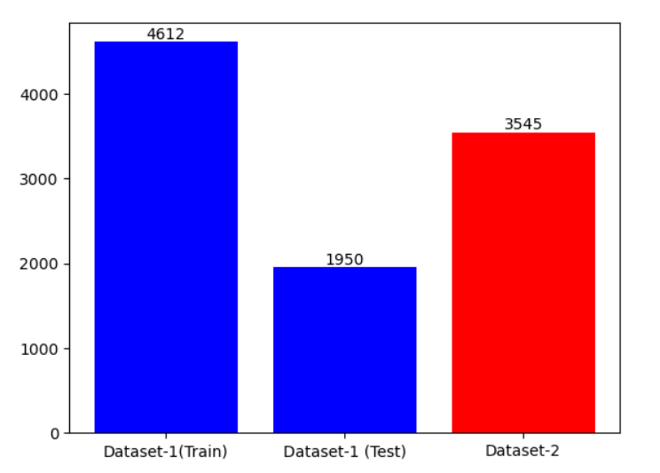
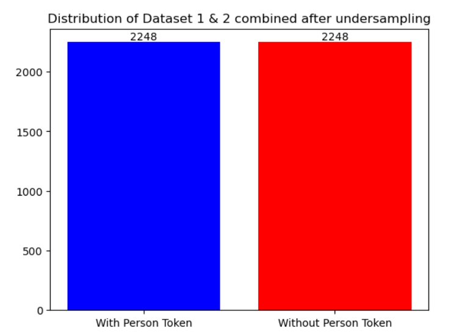

# Bengali_NER
## Problem Statement
Building a person-name extractor for Bangla. It will take a sentence as input and output the person name present in the input sentence. The model should also be able to handle cases where no person’s name is present in the input sentence.

Example -
 input: আব্দুর রহিম নামের কাস্টমারকে একশ টাকা বাকি দিলাম
 output: আব্দুর রহিম
 input: অর্থনীতি ও আর্থসামাজিক বেশির ভাগ সূচকে বাংলাদেশ ছাড়িয়ে গেছে দক্ষিণ এশিয়াকে ।
 output: [] 

## Solution Approach:
As this is a name entity extraction task, it was handled as token classification task. First i preprocessed the given data, making appropiate for token classification modeling, then experimented with different huggingface models for the task. Then i train the models with these experimented results and build an inference script which will load the best saved models (saved in training processe) and do prediction using the model and then post process the model output for desire output format.

## Datasets:
For this  task two dataset were used. These are open source datasets which can be downloaded from the following links.

Dataset-1: <a href= "https://github.com/Rifat1493/Bengali-NER/tree/master/annotated%20data"> [Rifat1493/Bengali-NER] </a>
  Dataset-2: <a href= "https://raw.githubusercontent.com/banglakit/bengali-ner-data/master/main.jsonl"> [banglakit/bengali-ner-data] </a>

### Dataset-1 description: 
Dataset -1 contains annotation data in `.txt` file format. From this dataset repository we take train_data.txt and test_data.txt file for our task. These files resides in <a href= "https://github.com/Rifat1493/Bengali-NER/blob/master/Input/train_data.txt"> master/inptut/train_data.txt </a> and <a href= "https://github.com/Rifat1493/Bengali-NER/blob/master/Input/test_data.txt">master/inptut/test_data.txt </a>.

 `Total sentences in train.txt= 4612`
 `Total sentences in test.txt= 1950`

 Annotation format in Dataset-1:
 লালপুর	B-LOC
 (	O
 নাটোর	B-LOC
 )	O
 প্রতিনিধি	O
 ব্রাহ্মণবাড়িয়া-২	B-LOC
 (	O
 সরাইল-আশুগঞ্জ	I-LOC
 )	O
 আসনে	O
 নির্বাচন	O
 থেকে	O
 সরে	O
 দাঁড়িয়েছেন	O
 আওয়ামী	B-ORG
 লীগের	I-ORG
 নেতৃত্বাধীন	O
 ১৪-দলীয়	B-ORG
 জোটের	I-ORG
 শরিক	O
 জাসদের	B-ORG
 (	O
 ইনু	B-PER
 )	O
 প্রার্থী	O
 আবু	I-PER
 বকর	I-PER
 মো	B-PER
 .	I-PER
 ফিরোজ	I-PER
 ।	O

### Dataset-2 description:
Dataset-2 contains data in `.jsonl` file format. This dataset is arranged in one file resides in <a href="https://github.com/banglakit/bengali-ner-data/blob/master/main.jsonl">master/main.jsonl</a>

 `Total sentences in dataset-2 : 3545`
 Annotation format in dataset-2:
 ["মো. নাহিদ হুসাইন নামের এক পরীক্ষার্থী অভিযোগ করেন, ইডেন মহিলা কলেজের পাঠাগার ভবনের দ্বিতীয় তলায় তাঁর পরীক্ষার আসন ছিল।", ["B-PERSON", "I-PERSON", "L-PERSON", "O", "O", "O", "O", "O", "O", "B-ORG", "I-ORG", "L-ORG", "O", "O", "O", "O", "O", "O", "O", "O", "O"]]

#### Dataset disribution:

### Dataset Preprocessing:

#### Dataset loading and annotation:
From the previous description we have seen that the two dataset are in two different format and their annotation format is totally different. So we have to pre-processe these data to convert these annotation to a common format. Moreover, there are some redundant annotations in the datasets like "ORG", "LOC" etc. We dont need these annotations. 
  First we converted all the input text in a common format. Our intented format is sentence level i.e all tokens of a sentence are combined in sentence not tokenized like in dataset-1. For that we converted dataset-1 to out intented format.

  For our person name extraction task we only need `B-PER`(Begining of the name), `I-PER`(Inside of the name), `O`(others). So we converted all the annotations in both dataset to our desired format.

  Example:
 `previous annotation`: ["B-PERSON", "I-PERSON", "L-PERSON", "O", "O", "O", "O", "O", "O", "B-ORG", "I-ORG", "L-ORG", "O", "O", "O", "O", "O", "O", "O", "O", "O"]
 `new_annotation`: ["B-PER", "I-PER", "L-PER", "O", "O", "O", "O", "O", "O", "O", "O", "O", "O", "O", "O", "O", "O", "O", "O", "O", "O"]]

Coding for data-loading and pre-processing is implemented in `loading_dataset.py`. After running this script we will have a dataframe format data for particular dataset which can be used later for training purpose.

#### Exploratory Data Analysis (EDA)
After loading our data we did some data analysis. First we check all the all the data have proper annotation, especially we checked every token in the given text have corresponding annotaion. If there are missing annotation in the dataset, this data can't be used in training. 
  After analysing we found `1019` miss-match data in dataset-1 and `172` mis-match data in dataset-2. So we discarded these erroneous data from our datasets. 
  Then we checked if there is any common entries in train test datasets. For our test dataset we used dataset-1 testing data. After checking we found `67` common entries in train, test dataset. So we removed these common data from test dataset, because these common data may introduce data-leakage problem in our experiment.

  Next we check the distribution of our datasets. We checked how many input entries contains name entity. From my investigation, i found that there was not many name annotation data in the datasets. There were a huge imbalance in the datasets. The distribution of these datasets are given bellow.

  From the distribution we found that there are not much data with person token so, we have combined both of these dataset to a single dataset for training. And to metigate data imbalance problem we `downsample` data without person token sothat it doesn't suffer overfitting problem.
  After combining both of the data and downsampling majority class our dataset looks like the following ditribution.

